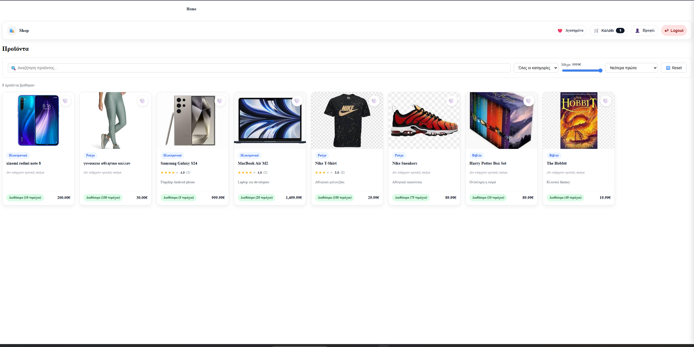
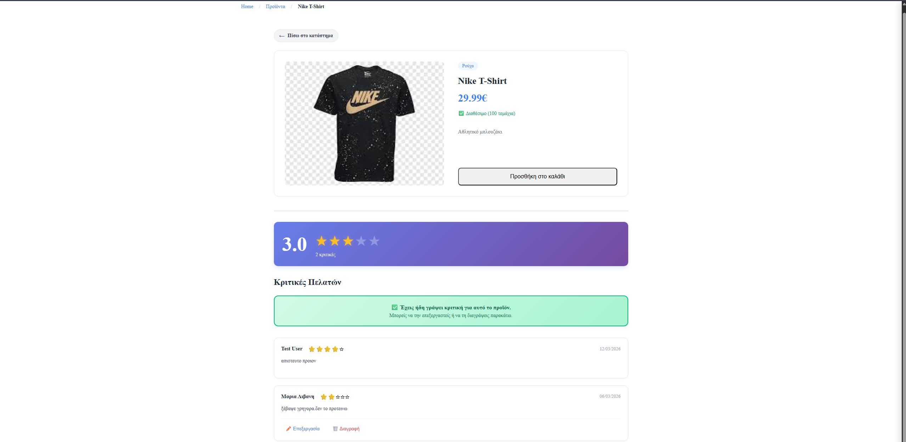
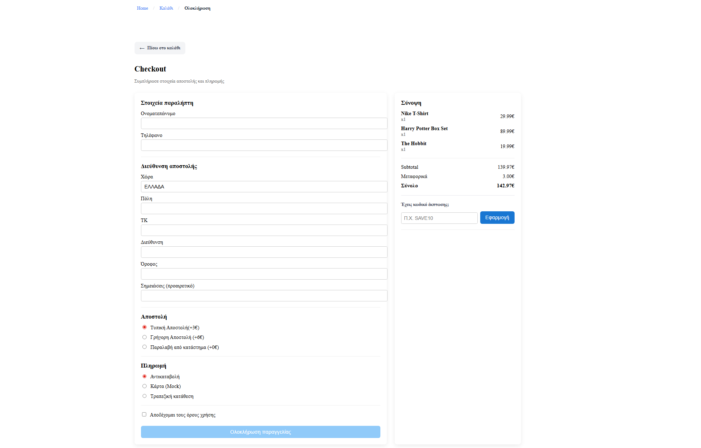
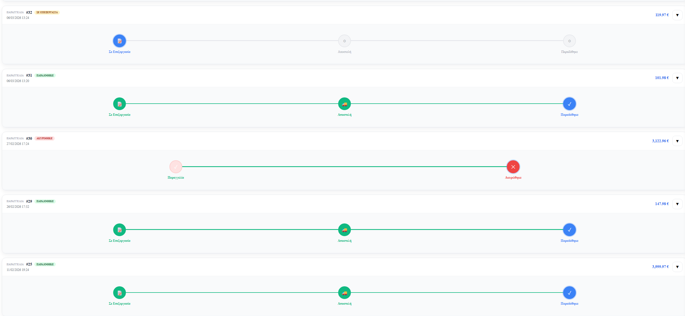
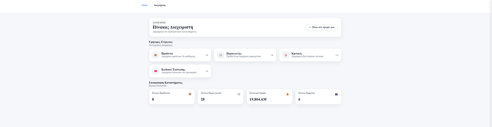
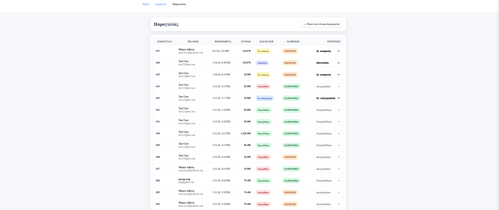

# E-Shop-World

Full-stack e-commerce application built with Angular 20, Node.js/Express 5, and MySQL. Users can browse products, manage a cart and wishlist, complete a multi-step checkout with discount codes, and track their orders. Admins get a dedicated dashboard for managing products, orders, reviews, and discount codes. Authentication is JWT-based with role-based access control.

---

## Features

### User
- Register & login with JWT sessions (24h expiry)
- Browse products — search by name/description, filter by category & price range, sort by price or name
- Add products to cart or wishlist
- Multi-step checkout: shipping address → shipping method → payment method → confirmation
- Apply discount codes at checkout (percentage or fixed, per-user usage limit)
- View order history with status timeline
- Download order receipts as PDF
- Submit, edit, and delete product reviews (verified purchases only — must have a delivered order)

### Admin
- Dashboard with store statistics: total orders, revenue, users, products
- Full product CRUD with image upload (5MB max, images only)
- Order management: view all orders, update status with enforced transitions
- Review moderation: view and delete any review
- Discount code CRUD: percentage/fixed types, expiry dates, max uses, min order amount
- Export any order as CSV

### UI
- Slide-in cart sidebar
- Skeleton loading screens
- Toast notifications (success / error / info / warning)
- Breadcrumb navigation
- Route guards: `authGuard` for user routes, `adminGuard` for admin routes
- JWT auto-attached to every HTTP request via interceptor

---

## Screenshots

### User
| | |
|---|---|
|  |  |
|  |  |

### Admin
| | |
|---|---|
|  |  |

> Full screenshots in [`screenshots/`](screenshots/)

---

## Tech Stack

| Layer | Technology |
|-------|-----------|
| Frontend | Angular 20 (Standalone Components) |
| Language | TypeScript 5.9 |
| Async | RxJS 7.8 |
| Backend | Node.js + Express 5 |
| Database | MySQL 8 (mysql2, connection pool) |
| Auth | JWT + bcrypt |
| File Uploads | Multer |
| PDF Generation | PDFKit |
| Dev Tooling | Nodemon, Angular CLI 20, Prettier, Karma/Jasmine |

---

## Getting Started

```sql
-- 1. Import schema (creates DB + all tables)
mysql -u root -p < backend/schema.sql
```

```bash
# 2. Backend — create backend/.env (see below), then:
cd backend && npm install && npm run dev

# 3. Frontend
npm install && npm start
```

`backend/.env`:
```env
DB_HOST=localhost
DB_PORT=3306
DB_USER=root
DB_PASSWORD=your_mysql_password
DB_NAME=ecommerce
JWT_SECRET=your_secret_key_here
PORT=3000
```

Backend: `http://localhost:3000` · Frontend: `http://localhost:4200`

---

## Git

```bash
git clone https://github.com/theopap7/E-Shop-World.git
cd E-Shop-World

git add .
git commit -m "your message"
git push origin main
git pull origin main
```

> `.env` is in `.gitignore` — never commit it. Each environment needs its own `.env`.
